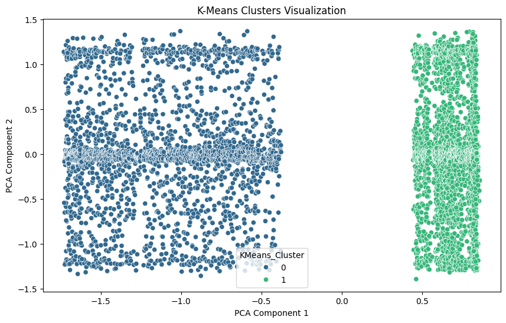

# UR3 CobotOps Clustering Analysis

## Overview
This project focuses on the clustering analysis of the UR3 CobotOps dataset. The dataset includes multidimensional time-series data from the UR3 cobot, offering insights into operational parameters and faults for machine learning in robotics and automation.

## Dataset
The UR3 CobotOps dataset is a comprehensive collection of data including:
- Electrical currents
- Temperatures
- Speeds across joints (J0-J5)
- Gripper current
- Operation cycle count
- Protective stops
- Grip losses

**Dataset Characteristics:**
- **Type:** Multivariate, Time-Series
- **Instances:** 7409
- **Features:** 20
- **Tasks:** Classification, Regression, Clustering

## Files in the Repository
1. `dataset_02052023.xlsx`: The dataset used for analysis.
2. `UR3 CobotOps - UCI Machine Learning Repository.pdf`: Documentation explaining the dataset and its variables.
3. `s41066-023-00417-7.pdf`: Scientific paper providing theoretical background on Fuzzy Cognitive Maps (FCMs) used in the analysis.
4. `UR3_CobotOps_Clustering_Annotated.ipynb`: Jupyter notebook with code and visualizations for clustering analysis.

## Analysis and Methodology
The project employs clustering techniques to analyze the UR3 CobotOps dataset. The primary methodology involves:
1. Data Pre-processing: Handling missing values, normalizing data, and encoding categorical variables.
2. Clustering: Applying various clustering algorithms to identify patterns and anomalies.
3. Visualization: Creating visualizations to interpret the clustering results.

### Key Visualizations
Here are some of the key visualizations from the analysis:


*Description: This visualization shows the clustering results of the UR3 CobotOps dataset using K-Means algorithm.*


*Description: This plot depicts the importance of different features in determining the clusters.*

## Reproducing the Analysis
To reproduce the analysis, follow these steps:

1. Clone the repository:
    ```sh
    git clone https://github.com/yourusername/ur3-cobotops-clustering.git
    cd ur3-cobotops-clustering
    ```

2. Install the required dependencies:
    ```sh
    pip install -r requirements.txt
    ```

3. Run the Jupyter notebook:
    ```sh
    jupyter notebook UR3_CobotOps_Clustering_Annotated.ipynb
    ```

## References
- [UR3 CobotOps Dataset - UCI Machine Learning Repository](https://archive.ics.uci.edu/dataset/963/ur3+cobotops)
- Tyrovolas, M., Liang, X. S., & Stylios, C. (2023). Information flow-based fuzzy cognitive maps with enhanced interpretability. Granular Computing, 8, 2021-2038. [DOI: 10.1007/s41066-023-00417-7](https://doi.org/10.1007/s41066-023-00417-7)

## License
This project is licensed under the Creative Commons Attribution 4.0 International (CC BY 4.0) license. For more details, see the [LICENSE](LICENSE) file.

## Acknowledgements
This work was supported by the Department of Informatics and Telecommunications, University of Ioannina, and the Industrial Systems Institute, Athena Research Center.

